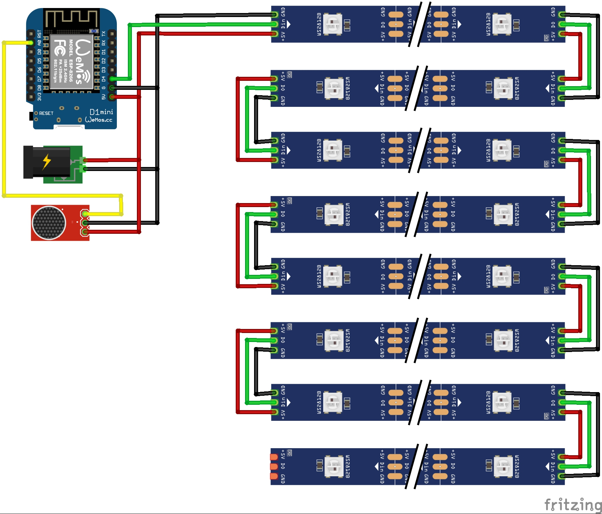

# Nanoleaf Web Server

This is a fork of [jasoncoon's esp8266 fastled webserver](https://github.com/jasoncoon/esp8266-fastled-webserver) that was adapted to control the colors of my  [DIY-Nanoleaf Replica](https://www.thingiverse.com/thing:3354082).

## Changelog

### 01.02.2020, Native Alexa Update

- **NodeRED** part is now **DEPRECATED**
- The Nanoleaf Replica allows now for **NATIVE** Alexa support without the need of an extra Raspberry Pi. When added to the Smart Home devices in the Alexa app, the nanoleafs will appear as Phillips Hue devices.
- Added Strobe Pattern
- Added Sound Reactive support
- Some code cleanup and new parameters to configure
- New step by step installation instructions ([Software_Installation.md](Software_Installation.md))

### 24.02.2019, NodeRED Update (Depricated)

- Node-RED integration was added
- Alexa support via NodeRED

### Bill of Materials

- 1x [Wemos D1 mini](http://s.click.aliexpress.com/e/_srb2XX) is recommended, but any other ESP8266 variant should work too, but it might require an additional step-down converter.
- [WS2812B LED Strip **IP30**](http://s.click.aliexpress.com/e/_sUwhA1), only IP30 will fit inside the nanoleafs, I'll recommend at least 60LEDs/m
- 1x [Microphone Sensor](http://s.click.aliexpress.com/e/_sYiUrz) (Optional), MAX4466 Sensor is recommended
- 1x [3.3V to 5V Logic Level Shifter](http://s.click.aliexpress.com/e/_s49Saz) (optional, required if LEDs "glitch")
- 1x [Female Power Jack](http://s.click.aliexpress.com/e/_sPe0RR)
- 1x [5V Power Supply](http://s.click.aliexpress.com/e/_sIzXbC), Note: 100 LEDs draw around 4A

Hardware
--------

**Check out the project on [Thingiverse](https://www.thingiverse.com/thing:3354082) for more details.**

Installation
--------
**FOR INSTALLATION REFER TO THE [Software_Installation.md](Software_Installation.md)**

Features
--------
* Turn the LEDs on and off
* Appear as an **ALEXA SMART HOME DEVICE**
* **Sound Reactive Mode**
* Adjust the brightness, color and patterns
* Play over 30+ patterns in Autoplay

Web App
--------

The web app is stored in SPIFFS (on-board flash memory).

## Circuit

## Technical

Patterns are requested by the app from the ESP8266, so as new patterns are added, they're automatically listed in the app.

The web app is stored in SPIFFS (on-board flash memory).

The web app is a single page app that uses [jQuery](https://jquery.com) and [Bootstrap](http://getbootstrap.com).  It has buttons for On/Off, a slider for brightness, a pattern selector, and a color picker (using [jQuery MiniColors](http://labs.abeautifulsite.net/jquery-minicolors)).  Event handlers for the controls are wired up, so you don't have to click a 'Send' button after making changes.  The brightness slider and the color picker use a delayed event handler, to prevent from flooding the ESP8266 web server with too many requests too quickly.

The only drawback to SPIFFS that I've found so far is uploading the files can be extremely slow, requiring several minutes, sometimes regardless of how large the files are.  It can be so slow that I've been just developing the web app and debugging locally on my desktop (with a hard-coded IP for the ESP8266), before uploading to SPIFFS and testing on the ESP8266.

### Alexa

The code has an optional feature to be able to control the lamp via Alexa on any Amazon Echo device. For setup instructions refer to [Software_Installation.md](https://github.com/NimmLor/esp8266-fastled-desk-light/blob/master/Software_Installation.md) document.

### Compression

The web app files can be gzip compressed before uploading to SPIFFS by running the following command:

`gzip -r data/`

The ESP8266WebServer will automatically serve any .gz file.  The file index.htm.gz will get served as index.htm, with the content-encoding header set to gzip, so the browser knows to decompress it.  The ESP8266WebServer doesn't seem to like the Glyphicon fonts gzipped, though, so I decompress them with this command:

`gunzip -r data/fonts/`

### REST Web services

The firmware implements basic [RESTful web services](https://en.wikipedia.org/wiki/Representational_state_transfer) using the ESP8266WebServer library.  Current values are requested with HTTP GETs, and values are set with POSTs using query string parameters.  It can run in connected or standalone access point modes.

